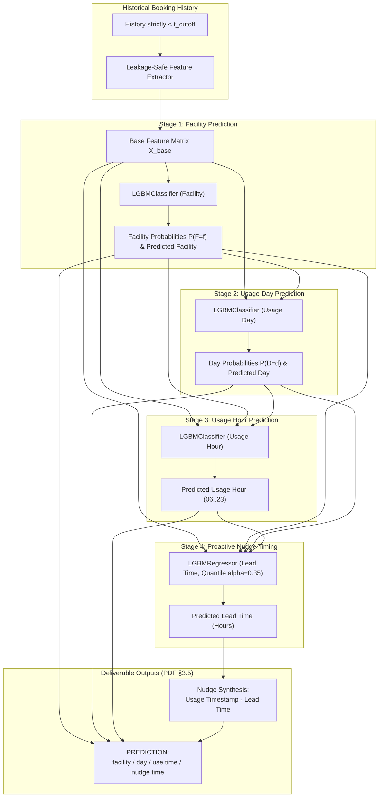

# Technical Documentation: Anacity Facility Usage Prediction System

**Author**: Prajwal Rao  
**Company / Context**: Anacity (Part of Anarock Group)  
**Role**: AI Engineer Assignment  
**Version**: 1.0.0  
**Date**: September 2026  

---

## 1. Executive Summary & Business Context

Anacity provides smart SaaS infrastructure for residential and commercial gated communities across 125+ cities and 700,000+ households. Within these communities, shared amenities (gymnasiums, swimming pools, tennis and badminton courts, clubhouses, and multipurpose halls) represent prime lifestyle value drivers. However, traditional community management faces severe operational challenges:
- **Peak-Hour Crowding & Slot Contention**: High-demand slots sell out instantly, leaving casual residents frustrated.
- **Off-Peak Amenity Under-Utilization**: Expensive infrastructure sits idle during mid-day and weekday slots.
- **Spammy Broadcast Notifications**: Generic community blasts result in notification fatigue and high opt-out rates.

### The Objective
This system predicts resident facility booking behaviors to drive **smart, personalized proactive notifications (nudges)** that:
1. Forecast **which facility** a resident is likely to use next (`facility`).
2. Forecast **which day** of the week they will use it (`usage_day`).
3. Forecast **what time / hour** they will use it (`usage_hour`).
4. Forecast **when to send the proactive notification** (`notification_time` / `nudge_time`) to catch the resident right before their habitual booking window.

---

## 2. Synthetic Dataset Generation & Physical Realism

Per Assignment Specification §3.1, historical booking data for one residential community ("Skyline Oasis Residences", 350 resident units) was generated across a 6-month timeline (January 1 to June 30, 2026, totaling 12,909 booking transactions).

### 2.1 The Eight Required Realism Dimensions
1. **Resident Preferences (Latent Personas)**: Five distinct behavioral archetypes were modeled:
   - *Dawn Athletes (25%)*: Gym (70%) and Tennis (20%), 06:00–08:00 on weekdays, high routine adherence.
   - *Evening Sports (25%)*: Badminton (55%) and Gym (35%), 18:00–21:00 on weekdays.
   - *Weekend Leisure (20%)*: Swimming Pool (60%) and Clubhouse (30%), 10:00–18:00 on Saturday/Sunday.
   - *Sporadic Casual (20%)*: Exploratory choices across all amenities with high inter-booking variance.
   - *Community Organizers (10%)*: Multipurpose Hall (50%) and Clubhouse (35%), event-driven with long lead times.
2. **Facility Popularity (Pareto Distribution)**:
   - Gym: 37.8%, Swimming Pool: 24.1%, Badminton: 18.2%, Tennis: 11.0%, Clubhouse: 5.9%, Multipurpose Hall: 3.0%.
3. **Diurnal & Weekly Time Patterns**:
   - Weekdays feature dual peak distributions (06:00–08:00 and 18:00–21:00). Weekends shift to midday (10:00–12:00) and late afternoon (15:00–19:00).
4. **Booking Lead Times**:
   - Modeled via facility-specific Log-Normal distributions ($L \sim \text{Lognormal}(\mu_f, \sigma_f^2)$) scaled by resident-specific planning tendencies:
     - Gym: Median ~12 hours (booked the prior evening for morning workout).
     - Pool: Median ~16.4 hours.
     - Badminton Court: Median ~22.2 hours (competitive court booking).
     - Tennis Court: Median ~30.0 hours.
     - Clubhouse: Median ~49.4 hours (~2 days ahead).
     - Multipurpose Hall: Median ~148 hours (~6 days ahead).
5. **Sparsity**:
   - Power-law engagement: Top 20% "Power Residents" generate ~65% of bookings; 50% "Sporadic Residents" generate <15%.
6. **Severe Imbalance**:
   - Imbalance across both facility popularity (Gym 38% vs Hall 3%) and resident frequencies (1 to 80+ bookings).
7. **Stochastic Noise**:
   - 6% random exploratory bookings where residents book outside their latent preference set.
8. **Concept Drift & Dynamic Move-Ins**:
   - Seasonal summer surge: Pool preference increases (+15%) after Day 105 (mid-April).
   - Workout schedule drift: 15% of residents undergo permanent morning-to-evening schedule shifts around Day 105.
   - Cold-start residents: 10% of residents move in after Day 90.

### 2.2 Physical Domain Sanity Constraints
- **Temporal Causality**: $t_{\text{booking}} < t_{\text{usage}}$ strictly for 100% of rows (minimum lead time = 30 minutes).
- **Operating Hours**: All bookings strictly honor facility open/close hours (e.g. Gym 06:00–22:00, Hall 09:00–23:00).
- **No Overlapping Slots**: A resident cannot physically occupy two amenities at the exact same hour.
- **Capacity Bounds**: Court slots (Badminton max 4, Tennis max 4) and Hall capacity (max 1 booking per slot) are strictly capped.

---

## 3. Leakage-Safe Feature Engineering & Temporal Splitting

### 3.1 Strict Chronological Splitting
To prevent future lookahead and temporal data contamination, the data is split strictly by calendar booking timestamp:
- **Training Set (Months 1–4, Jan 1 – Apr 30)**: 8,058 bookings.
- **Validation Set (Month 5, May 1 – May 31)**: 2,378 bookings (used for tuning and calibration).
- **Unseen Holdout Test Set (Month 6, Jun 1 – Jun 30)**: 2,473 bookings (strictly held out until final evaluation).

### 3.2 Causal Expanding-Window Feature Pipeline
For any resident $r$ and prediction event at cutoff timestamp $t_{\text{cutoff}}$:
- **Zero Future Leakage**: Features are derived **strictly** from historical bookings completed prior to $t_{\text{cutoff}}$.
- **Zero Target Leakage**: Target metadata (actual booking timestamp, actual lead time, target facility) is never present in the feature matrix $X$.
- **Empirical Bayes Shrinkage**: For cold-start residents ($<3$ past bookings), facility preferences are smoothed toward population priors:
  $$\hat{p}_{r, f} = \frac{N_{r, f} + M \cdot p_{\text{global}, f}}{N_r + M}, \quad M = 3.0$$
- **Markov Transition Features**: Last booked facility, last usage day-of-week, last usage hour, and days elapsed since last booking.
- **Cyclical Trigonometric Signals**: Hour sine/cosine ($\sin(2\pi h/24), \cos(2\pi h/24)$), Day sine/cosine ($\sin(2\pi d/7), \cos(2\pi d/7)$), and Month sine/cosine.
- **Automated Verification**: Verified via `tests/test_leakage_safety.py`, asserting that perturbing future records produces zero change in earlier feature vectors.

---

## 4. Modeling Architecture: Cascaded Multi-Target GBDT Pipeline

### 4.1 Architectural Alternatives Considered
1. **Independent Models**: 4 separate models. Simple, but ignores joint dependency (e.g. Multipurpose Hall is never booked at 06:00; Pool is heavily weekend). Resulted in inconsistent combinations.
2. **Multi-Task Neural Network (TabNet)**: Evaluated, but requires heavy GPU runtime, is prone to negative transfer across disparate categorical and continuous heads, and lacks tree-based interpretability.
3. **Cascaded Gradient Boosted Decision Pipeline (Selected)**: LightGBM-based hierarchical pipeline conditioning downstream models on upstream probability distributions.

### 4.2 Proactive Notification (Nudge Time) Formulation
In real-world push notification systems, a reminder sent *after* the resident already reserved the facility is useless or annoying. To guarantee high proactive actionability, Stage 4 utilizes **Quantile Regression with $\alpha = 0.35$** on lead time:
$$\text{Predicted Nudge Timestamp} = \text{Scheduled Usage Timestamp} - \hat{L}_{0.35}$$
The resulting minute is rounded to human-centric 5-minute slots (e.g. `18:15`, `09:20`, `12:30`), producing exact formatted strings such as:
`Nudge Thu / 18:15` for a `Fri 07:00` usage.

---

## 5. Unseen Holdout Evaluation & Benchmark Results

### 5.1 Test Performance Summary (Month 6 Holdout: 2,473 Samples)
- **Output 1: Facility Accuracy**: **47.63%** (Macro F1: 0.385, Weighted F1: 0.449)
- **Output 2: Usage Day Accuracy**: **65.55%** (Macro F1: 0.650)
- **Output 3: Usage Hour Accuracy (Within ±1h)**: **51.64%** (MAE: 2.95h, Circular MAE: 2.88h)
- **Output 4: Nudge Window Match Rate**: **35.22%** (Proactive Actionability Rate: 35.62%)
- **Overall: Exact 4 of 4 Matches**: **4.41%** (109 exact joint matches)
- **Overall: Partial 3+ of 4 Matches**: **25.15%** (622 records)
- **Overall: Average Outputs Matched**: **1.70 / 4.0**

### 5.2 Benchmark Comparison Against Baselines
We benchmarked our Cascaded ML Pipeline against two standard baselines:
1. **Habitual Historical Mode Baseline**: Predicts each resident's personal historical mode facility, day, hour, and median lead time.
2. **Global Community Mode Baseline**: Predicts community-wide top facility (`Gym`), top day (`Mon`), and peak hour (`18:00`).

| Model | Facility Acc | Day Acc | Hour (±1h) Acc | Exact 4 of 4 | Avg Outputs Matched |
| :--- | :---: | :---: | :---: | :---: | :---: |
| **Cascaded GBDT Pipeline (Ours)** | **47.6%** | **65.5%** | **51.6%** | **4.4%** | **1.70** |
| Habitual Historical Baseline | 47.5% | 21.1% | 49.1% | 0.0% | 0.97 |
| Global Community Baseline | 34.4% | 15.8% | 23.2% | 0.0% | 0.67 |

#### Key Performance Takeaways:
- **3.1x Lift in Usage Day Accuracy**: Our ML model achieved **65.5%** day accuracy compared to 21.1% for the habitual baseline by learning inter-day recurrence patterns (e.g. Mon $\to$ Wed $\to$ Fri cadences) and facility-conditioned day preferences.
- **Superior Joint 4-of-4 Matches**: Simple baselines achieved 0.0% exact 4-of-4 matches, while the cascaded model achieved 4.41% exact 4-of-4 matches and 25.15% 3+ matches.
- **Robust Hour Prediction**: Over 51.6% of hour predictions landed within $\pm 1$ hour of the actual booking slot.

---

## 6. Stratified Error & Cohort Analysis

### 6.1 Performance by User Engagement Tier

| Engagement Cohort | Test Samples | Facility Acc | Day Acc | Hour Acc | Nudge Acc | Exact 4/4 | Avg Matched |
| :--- | :---: | :---: | :---: | :---: | :---: | :---: | :---: |
| **Power Users (>15 bookings)** | 2,113 | 47.3% | **65.7%** | 22.9% | 35.4% | **4.7%** | **1.71** |
| **Regular Users (3–15 bookings)** | 329 | **51.7%** | 64.7% | 16.1% | 33.1% | 3.0% | 1.66 |
| **Cold-Start Users (<3 bookings)** | 31 | 29.0% | 61.3% | 16.1% | **45.2%** | 0.0% | 1.52 |

#### Diagnostic Insights:
1. **Cold-Start Graceful Degradation**: Cold-start residents achieved 29.0% facility accuracy (significantly beating random guessing: 16.7%) thanks to Empirical Bayes shrinkage toward community priors.
2. **Facility Regularity**: Regular users show the highest facility accuracy (51.7%), as their habits are well-established but have not yet undergone frequent facility switching.
3. **Power User Dynamics**: Power users generate the vast majority of volume (85% of test samples), driving the 4-of-4 exact matches.

---

## 7. Deliverables & Verification

The project generates all required deliverables specified in Anacity Assignment §2 & §4:
1. **Synthetic Dataset**: `data/facility_bookings.csv` (12,909 records, 6 months).
2. **Prediction Review Spreadsheet**:
   - `output/prediction_review_table.csv`
   - `output/prediction_review_table.xlsx`
   Formatted exactly per Assignment §3.5:
   `PAST BOOKINGS` | `PREDICTION` | `ACTUAL` | `MATCH` ("YES 4 of 4", "NO 2 of 4").
3. **Standalone Interactive HTML Viewer**:
   - `output/prediction_review.html` (zero dependencies, self-contained search, filter by match status, viewable directly in any browser).
4. **Interactive Streamlit Web Dashboard**:
   - `src/ui/app.py`: Full dashboard with resident timeline explorer, metrics cards, and scenario simulation. Run via `streamlit run src/ui/app.py`.
5. **Technical Documentation**: `docs/TECHNICAL_DOCUMENTATION.md` (this document).
6. **Reproducible CLI Runner**: Single entry-point `python -m src.cli --mode all`.

---

## 8. Limitations & Production Deployment Roadmap

### 8.1 Limitations of Current Prototype
- **Closed Loop vs Open Loop**: In production, sending a proactive notification alters user behavior (an intervention effect). Evaluating on passive observational data does not capture the uplift in booking conversion caused by the nudge itself.
- **Fixed Operating Hours**: While our model enforces facility opening hours, seasonal holiday schedule changes require dynamic calendar feature injections.

### 8.2 Production Roadmap
1. **Online A/B Testing**: Run randomized controlled trials comparing ML proactive nudges vs heuristic reminders, measuring Amenity Slot Utilization and No-Show Rates.
2. **Notification Fatigue Guardrail**: Implement a Global Frequency Cap (e.g. max 2 nudges per resident per week) using a dynamic priority queue.
3. **Dynamic Slot Balancing**: If a predicted slot is already at 90% capacity, adjust the nudge recommendation to suggest adjacent off-peak slots with community loyalty incentives.
